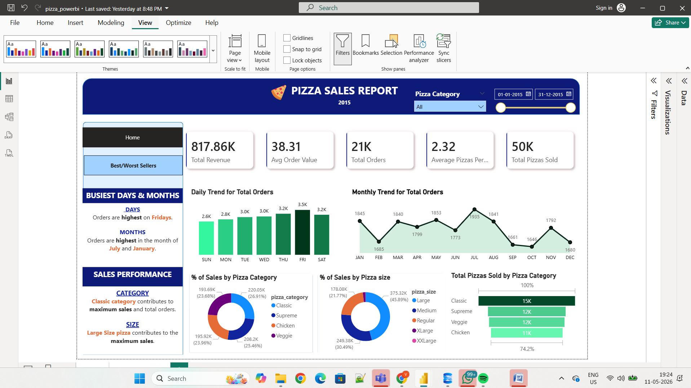

# Pizza Sales Analysis using SQL & Power BI

## Project Overview
This project analyzes pizza sales data using SQL and Power BI to uncover sales trends, customer behavior, and business insights.

## Tools Used
- SQL Server
- SSMS
- Power BI
- DAX
- Power Query

## Key Insights
- Total Revenue
- Best Selling Pizzas
- Sales by Category
- Peak Days of week
- Monthly Trends
- Order Analysis

## Files Included
- Power BI Dashboard (.pbix)
- SQL Queries (.sql)
- Dashboard Images
- Dataset

## Dashboard Preview

# Pizza-Sales-Analysis
SQL and Power BI project analyzing Pizza Sales trends and KPIs
